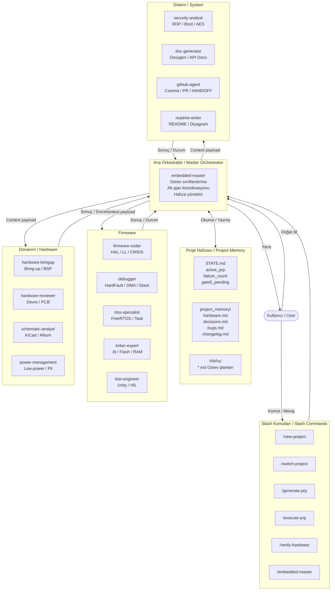
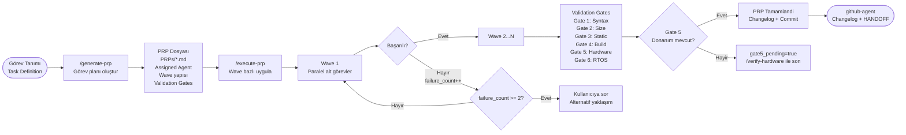
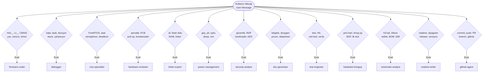

# WID — Works In Debug

> STM32 ve gömülü sistem geliştirme için özelleştirilmiş Claude Code agent sistemi.
> A specialized Claude Code agent system for STM32 and embedded systems development.

[]()
[]()
[]()
[]()

---

## Genel Bakış / Overview

**TR:** WID, STM32 firmware geliştirme sürecini uçtan uca yöneten bir Claude Code agent sistemidir. Tek bir ana orkestratör (`embedded-master`) altında 13 uzman agent çalışır: firmware yazma, debug, donanım bring-up, FreeRTOS, güvenlik, şematik analiz ve daha fazlası. Slash komutları ile proje kurulumu, görev planlaması (PRP) ve donanım doğrulaması otomatize edilmiştir.

**EN:** WID is a Claude Code agent system that manages the STM32 firmware development lifecycle end-to-end. Thirteen specialist agents operate under a single master orchestrator (`embedded-master`): firmware coding, debugging, hardware bring-up, FreeRTOS, security, schematic analysis, and more. Slash commands automate project setup, task planning (PRP), and hardware verification.

---

## Sistem Mimarisi / System Architecture



---

## PRP Yaşam Döngüsü / PRP Lifecycle



---

## Agent Listesi / Agent List

### Ana Orkestratör / Master Orchestrator

| Agent | Dosya | Rol / Role |
|-------|-------|------------|
| **embedded-master** | `commands/embedded-master.md` | Tum ajanları koordine eder; görev sınıflandırma, hafıza yönetimi, hata yönetimi. Coordinates all agents; task classification, memory management, failure handling. |

### Firmware Ajanları / Firmware Agents

| Agent | Dosya | Rol / Role |
|-------|-------|------------|
| **firmware-coder** | `agents/firmware-coder.md` | HAL, LL, CMSIS seviyelerinde C kodu üretir. Peripheral sürücüler, DMA, interrupt. Generates C code at HAL/LL/CMSIS level. Peripheral drivers, DMA, interrupts. |
| **debugger** | `agents/debugger.md` | HardFault, MemManage, BusFault analizi. DMA hataları, stack overflow, register dump. HardFault/BusFault analysis, DMA errors, stack overflow, register-level debugging. |
| **rtos-specialist** | `agents/rtos-specialist.md` | FreeRTOS görev mimarisi, öncelik ataması, deadlock analizi, ISR-safe API. FreeRTOS task architecture, priority assignment, deadlock analysis. |
| **linker-expert** | `agents/linker-expert.md` | .ld dosyası yazma/analizi, flash/RAM bütçe hesabı, bootloader bölümleme. Linker script authoring, flash/RAM budget analysis, bootloader partitioning. |
| **test-engineer** | `agents/test-engineer.md` | Unity/CMock unit testleri, HIL senaryoları, boundary değer analizi. Unity/CMock unit tests, HIL scenarios, boundary value analysis. |

### Donanım Ajanları / Hardware Agents

| Agent | Dosya | Rol / Role |
|-------|-------|------------|
| **hardware-bringup** | `agents/hardware-bringup.md` | Yeni kart devreye alma, BSP geliştirme, clock tree doğrulama, peripheral test sırası. New board bring-up, BSP development, clock tree validation. |
| **hardware-reviewer** | `agents/hardware-reviewer.md` | Şematik inceleme, PCB kural kontrolü, pull-up/down hesabı, decoupling tasarımı. Schematic review, PCB rule check, pull-up calculations, decoupling design. |
| **schematic-analyst** | `agents/schematic-analyst.md` | KiCad/Altium dosyalarını okur; güç bütünlüğü, sinyal bütünlüğü, EMI/EMC, DFM analizi. Reads KiCad/Altium files; power integrity, signal integrity, EMI/EMC, DFM analysis. |
| **power-management** | `agents/power-management.md` | Sleep/Stop/Standby modları, clock gating, RTC wake-up, pil ömrü hesabı. Sleep/Stop/Standby modes, clock gating, RTC wake-up, battery life calculation. |

### Sistem Ajanları / System Agents

| Agent | Dosya | Rol / Role |
|-------|-------|------------|
| **security-analyst** | `agents/security-analyst.md` | RDP seviyeleri, güvenli boot, AES şifreleme, JTAG koruması, saldırı yüzeyi analizi. RDP levels, secure boot, AES encryption, JTAG protection, attack surface analysis. |
| **doc-generator** | `agents/doc-generator.md` | Doxygen yorumları, API referans belgeleri, hardware.md/decisions.md güncellemesi. Doxygen comments, API reference docs, hardware.md/decisions.md updates. |
| **github-agent** | `agents/github-agent.md` | Enriched Conventional Commits, HANDOFF.md üretimi, PR yönetimi, changelog güncellemesi. Enriched Conventional Commits, HANDOFF.md generation, PR management, changelog updates. |
| **readme-writer** | `agents/readme-writer.md` | README oluşturma/güncelleme, Mermaid diyagramları, fotoğraf talimatları. README creation/updates, Mermaid diagrams, photo placement instructions. |

---

## Görev Tetikleyici Eşleştirmesi / Task Trigger Mapping



---

## Slash Komutları / Slash Commands

| Komut / Command | Dosya | Açıklama / Description |
|----------------|-------|------------------------|
| `/embedded-master` | `commands/embedded-master.md` | Ana orkestratörü aktive eder. STATE.md ve proje hafızasını okuyarak oturumu başlatır. Activates the master orchestrator. Reads STATE.md and project memory to start the session. |
| `/new-project` | `commands/new-project.md` | Yeni STM32 projesi kurar. CLAUDE.md, PROJECT.md, STATE.md, REQUIREMENTS.md, ROADMAP.md ve `project_memory/` oluşturur. Sets up a new STM32 project with all required files and directory structure. |
| `/switch-project <yol>` | `commands/switch-project.md` | Farklı bir embedded-master projesine geçer. Mevcut bağlamı kaydeder, hedef projeyi yükler. Switches to a different embedded-master project, saving current context and loading the target. |
| `/generate-prp "<görev>"` | `commands/generate-prp.md` | Görev açıklaması için PRP (Product Requirements Prompt) dosyası oluşturur, ajan atar, wave yapısını planlar. Generates a PRP file for a task description, assigns an agent, and plans the wave structure. |
| `/execute-prp [prp_yolu]` | `commands/execute-prp.md` | PRP'yi wave bazlı uygular. Validation gates çalıştırır, başarısızlıkları yönetir, changelog ve commit üretir. Executes a PRP wave-by-wave, runs validation gates, manages failures, produces changelog and commit. |
| `/verify-hardware` | `commands/verify-hardware.md` | STATE.md'de `gate5_pending=true` olan ertelenmiş donanım doğrulamalarını (Gate 5) çalıştırır. Runs deferred hardware verifications (Gate 5) for PRPs with `gate5_pending=true`. |

---

## Kurulum / Setup

### Gereksinimler / Requirements

- [Claude Code CLI](https://claude.ai/code) kurulu olmalı / must be installed
- Kullanıcı `~/.claude/` klasörünü tanıyan bir ortam / an environment with `~/.claude/` directory

### Kurulum Adımları / Installation Steps

**TR:**

1. Bu repoyu `~/.claude/` klasörüne kopyalayın veya sembolik bağ oluşturun:

```bash
# Seçenek 1: Doğrudan kopyalama
cp -r agents/ ~/.claude/agents/
cp -r commands/ ~/.claude/commands/
cp -r templates/ ~/.claude/templates/

# Secenek 2: Sembolik bag (onerilen — degisiklikler aninda yansir)
ln -s /path/to/WID/agents ~/.claude/agents
ln -s /path/to/WID/commands ~/.claude/commands
ln -s /path/to/WID/templates ~/.claude/templates
```

2. Global `CLAUDE.md` dosyasını yapılandırın:

```bash
cp CLAUDE.md ~/.claude/CLAUDE.md
```

**EN:**

1. Copy this repo's folders to `~/.claude/` or create symbolic links:

```bash
# Option 1: Direct copy
cp -r agents/ ~/.claude/agents/
cp -r commands/ ~/.claude/commands/
cp -r templates/ ~/.claude/templates/

# Option 2: Symbolic link (recommended — changes reflect immediately)
ln -s /path/to/WID/agents ~/.claude/agents
ln -s /path/to/WID/commands ~/.claude/commands
ln -s /path/to/WID/templates ~/.claude/templates
```

2. Configure the global `CLAUDE.md` file:

```bash
cp CLAUDE.md ~/.claude/CLAUDE.md
```

---

## Nasıl Kullanılır / How to Use

### 1. Yeni Proje Baslat / Start a New Project

```
/new-project
```

**TR:** Komut çalıştırıldığında agent sırayla sorar: proje adı, MCU modeli, amaç, clock frekansı, FreeRTOS kullanımı ve gereksinimler. Tüm proje dosyaları otomatik oluşturulur.

**EN:** When the command runs, the agent asks sequentially: project name, MCU model, purpose, clock frequency, FreeRTOS usage, and requirements. All project files are created automatically.

### 2. Master Agent'i Aktive Et / Activate Master Agent

```
/embedded-master
```

**TR:** Her yeni oturumda bu komutla başlayın. Agent STATE.md ve `project_memory/` dosyalarını okuyarak mevcut durumu gösterir.

**EN:** Start every new session with this command. The agent reads STATE.md and `project_memory/` files to show the current status.

**Oturum başlangıç çıktısı / Session start output:**
```
Embedded Master Agent Aktif
Proje    : <proje_adi>
MCU      : <mcu_modeli>
Son durum: <STATE.md ozeti>
Aktif PRP: <active_prp veya "yok">
Nasil yardimci olabilirim?
```

### 3. Görev Planla / Plan a Task

```
/generate-prp "UART2 DMA tabanlı TX/RX sürücüsü implement et"
```

**TR:** PRP dosyası `PRPs/` klasörüne yazılır. Agent uygun uzman ajanı atar, wave yapısını ve validation gates'leri belirler, onayınızı ister.

**EN:** The PRP file is written to the `PRPs/` folder. The agent assigns the appropriate specialist, defines the wave structure and validation gates, and asks for your approval.

### 4. Gorevi Uygula / Execute a Task

```
/execute-prp
```

**TR:** Aktif PRP wave bazlı uygulanır. Her wave'de paralel alt görevler çalıştırılır. Gate 1-4 zorunludur; Gate 5 (donanım) kart bağlıysa çalıştırılır.

**EN:** The active PRP is executed wave-by-wave. Parallel sub-tasks run within each wave. Gates 1-4 are mandatory; Gate 5 (hardware) runs if the board is connected.

### 5. Dogal Dil ile Konuşun / Talk in Natural Language

**TR:** Slash komut kullanmak zorunda değilsiniz. Master agent mesajınızı analiz ederek doğru uzmanı seçer:

**EN:** You don't need to use slash commands. The master agent analyzes your message and selects the right specialist:

```
"SPI DMA transferinde veri bozuluyor"       -> debugger
"FreeRTOS'ta iki görev arasında deadlock"   -> rtos-specialist
"Flash dolmak üzere, optimizasyon lazım"    -> linker-expert
"KiCad şematikimi gözden geçirir misin?"    -> schematic-analyst
"Pil ömrünü uzatmak istiyorum"              -> power-management
"UART sürücüsü yaz"                         -> firmware-coder
```

### 6. Donanım Dogrulamasi / Hardware Verification

```
/verify-hardware
```

**TR:** Önceki oturumlarda donanım bağlı olmadığı için ertelenen Gate 5 doğrulamalarını çalıştırır. STM32 bağlıyken bu komutu verin.

**EN:** Runs Gate 5 verifications that were deferred in previous sessions because the hardware was not connected. Run this command when the STM32 is connected.

---

## Proje Hafıza Yapısı / Project Memory Structure

**TR:** Her embedded-master projesi aşağıdaki dosya yapısına sahiptir:

**EN:** Every embedded-master project has the following file structure:

```
<proje-klasoru>/
├── CLAUDE.md                    # STM32 kodlama standartlari
├── PROJECT.md                   # MCU, clock, proje hedefi
├── STATE.md                     # Aktif PRP, failure_count, git_language
├── REQUIREMENTS.md              # Fonksiyonel gereksinimler
├── ROADMAP.md                   # Fazlar ve tamamlanma kriterleri
├── HANDOFF.md                   # Oturum devamliligi (github-agent uretir)
├── PRPs/                        # Gorev planlamalari
│   └── <gorev-adi>.md
└── project_memory/
    ├── hardware.md              # MCU, pin atamalari, donanim notlari
    ├── decisions.md             # Mimari kararlar ve gerekceleri
    ├── bugs.md                  # Cozulmus hatalar ve yontemleri
    ├── progress.md              # Ilerleme kaydi
    └── changelog.md             # Aşama kayitlari (github-agent gunceller)
```

---

## Validation Gate Sistemi / Validation Gate System

**TR:** Her PRP uygulamasında sırayla çalıştırılan doğrulama adımları:

**EN:** Verification steps run sequentially for every PRP execution:

| Gate | Komut / Command | Açıklama / Description |
|------|----------------|------------------------|
| Gate 1 — Syntax | `arm-none-eabi-gcc -Wall -Werror -c src/<dosya>.c` | Derleme hatası yok / No compilation errors |
| Gate 2 — Size | `arm-none-eabi-size build/firmware.elf` | Flash/RAM bütçe kontrolü / Flash/RAM budget check |
| Gate 3 — Static | `cppcheck --enable=all src/<dosya>.c` | Statik analiz / Static analysis |
| Gate 4 — Build | `make clean && make` | Tam derleme / Full build |
| Gate 5 — Hardware | `openocd ... program ... verify reset exit` | Donanım testi — ertelenebilir / Hardware test — can be deferred |
| Gate 6 — RTOS | `uxTaskGetStackHighWaterMark() > 50 words` | FreeRTOS stack kontrolü / FreeRTOS stack check |

---

## Klasor Yapisi / Directory Structure

```
WID/
├── README.md
├── CLAUDE.md                        # Global Claude Code kurallari
├── agents/                          # 13 uzman agent prompt dosyasi
│   ├── debugger.md
│   ├── doc-generator.md
│   ├── firmware-coder.md
│   ├── github-agent.md
│   ├── hardware-bringup.md
│   ├── hardware-reviewer.md
│   ├── linker-expert.md
│   ├── power-management.md
│   ├── readme-writer.md
│   ├── rtos-specialist.md
│   ├── schematic-analyst.md
│   ├── security-analyst.md
│   └── test-engineer.md
├── commands/                        # Slash komut dosyalari
│   ├── embedded-master.md
│   ├── execute-prp.md
│   ├── generate-prp.md
│   ├── init-project.md
│   ├── new-project.md
│   ├── switch-project.md
│   └── verify-hardware.md
└── templates/                       # Proje sablonlari
    ├── changelog-template.md
    └── claude-stm32.md
```

---

## Lisans / License

Bu proje kişisel kullanım için geliştirilmiştir. / This project was developed for personal use.
